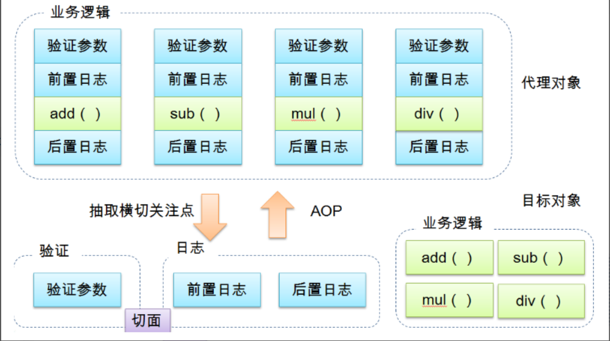

# spring 学习

## Maven 添加 spring 依赖

```xml
<!--spring-->
<dependency>
    <groupId>org.springframework</groupId>
    <artifactId>spring-webmvc</artifactId>
    <version>5.1.10.RELEASE</version>
</dependency>
```

```xml
<!--单元测试-->
<dependency>
    <groupId>junit</groupId>
    <artifactId>junit</artifactId>
    <version>4.12</version>
</dependency>
```

## ApplicationContext xml 基本配置项

```xml
<?xml version="1.0" encoding="UTF-8"?>
<beans xmlns="http://www.springframework.org/schema/beans"
       xmlns:xsi="http://www.w3.org/2001/XMLSchema-instance"
       xsi:schemaLocation="http://www.springframework.org/schema/beans
        http://www.springframework.org/schema/beans/spring-beans.xsd">

</beans>
```

## IOC创建对象方式

```xml
<!-- 第一种根据index参数下标设置 -->
<bean id="userT" class="com.demo.pojo.Hello">
    <!-- index指构造方法 , 下标从0开始 -->
    <constructor-arg index="0" value="spring"/>
</bean>
```

```xml
<!-- 第二种根据参数名字设置 -->
<bean id="userT" class="com.demo.pojo.Hello">
    <!-- name指参数名 -->
    <constructor-arg name="name" value="spring"/>
</bean>
```

```xml

<bean id="userT" class="com.demo.pojo.Hello">
    <!-- name指参数名 -->
    <constructor-arg type="java.lang.String" value="spring"/>
</bean>
```

# Bean的自动装配

```java
public class Cat {
    public void shout() {
        System.out.println("miao~");
    }
}
```

```java
public class Dog {
    public void shout() {
        System.out.println("wang~");
    }
}
```

```java
public class User {
    @Autowired
    private Cat cat;
    @Autowired
    private Dog dog;
    private String str;

    public Cat getCat() {
        return cat;
    }

    public Dog getDog() {
        return dog;
    }

    public String getStr() {
        return str;
    }
}
```

```xml
<?xml version="1.0" encoding="UTF-8"?>
<beans xmlns="http://www.springframework.org/schema/beans"
       xmlns:xsi="http://www.w3.org/2001/XMLSchema-instance"
       xmlns:context="http://www.springframework.org/schema/context"
       xsi:schemaLocation="http://www.springframework.org/schema/beans
       http://www.springframework.org/schema/beans/spring-beans.xsd
       http://www.springframework.org/schema/context
       http://www.springframework.org/schema/context/spring-context.xsd">

    <!--开启属性注解支持！-->
    <context:annotation-config/>
    <bean id="dog" class="com.demo.pojo.Dog"/>
    <bean id="cat" class="com.demo.pojo.Cat"/>
    <bean id="user" class="com.demo.pojo.User"/>
</beans>
```

## @Autowired

```text
@Autowired是按类型自动转配的，不支持id匹配。
```

## @Qualifier

```text
@Autowired 是根据类型自动装配的，加上@Qualifier则可以根据byName的方式自动装配
@Qualifier 不能单独使用。
```

## @Resource

```text
@Resource如有指定的name属性，先按该属性进行byName方式查找装配；
其次再进行默认的byName方式进行装配；
如果以上都不成功，则按byType的方式自动装配。
都不成功，则报异常。
```

## @Autowired与@Resource异同：

```text
@Autowired与@Resource都可以用来装配bean。都可以写在属性上，或写在setter方法上。
@Autowired默认按类型装配（属于spring规范），默认情况下必须要求依赖对象必须存在，如果要允许null 值，
可以设置它的required属性为false，如：@Autowired(required=false) ，如果我们想使用名称装配可以结合@Qualifier注解进行使用
@Resource（属于J2EE复返），默认按照名称进行装配，名称可以通过name属性进行指定。
如果没有指定name属性，当注解写在字段上时，默认取字段名进行按照名称查找，如果注解写在setter方法上默认取属性名进行装配。 
当找不到与名称匹配的bean时才按照类型进行装配。但是需要注意的是，如果name属性一旦指定，就只会按照名称进行装配。
它们的作用相同都是用注解方式注入对象，但执行顺序不同。@Autowired先byType，@Resource先byName。
```

# spring使用注解配置bean

```xml
<?xml version="1.0" encoding="UTF-8"?>
<beans xmlns="http://www.springframework.org/schema/beans"
       xmlns:xsi="http://www.w3.org/2001/XMLSchema-instance"
       xmlns:context="http://www.springframework.org/schema/context"
       xsi:schemaLocation="http://www.springframework.org/schema/beans
       http://www.springframework.org/schema/beans/spring-beans.xsd
       http://www.springframework.org/schema/context
       http://www.springframework.org/schema/context/spring-context.xsd">

    <!--    指定注解扫描包 这个包下的注解就会生效-->
    <context:component-scan base-package="com"/>
</beans>
```

```text
@Component
@Controller
@Repository
@Service
都是标记某个类自动装配到spring容器中的
```

```java

@Component("user")
// 相当于配置文件中 <bean id="user" class="当前注解的类"/>
public class UserDao {
    @Value("地瓜")
    // 相当于配置文件中 <property name="name" value="地瓜"/>
    public String name;
}
```

# 基于Java类进行配置

```java
// 编写实体类
@Component
public class User {
    @Value("地瓜")
    private String name;
}
```

```java
// 新建一个config配置包，编写一个AppConfig配置类
@Configuration //代表这是一个配置类
@Import(MyConfig2.class)  //导入合并其他配置类，类似于配置文件中的 inculde 标签
public class AppConfig {

    @Bean("user") // <bean id="user"/> 通过方法注册一个bean，这里的返回值就Bean的类型，方法名就是bean的id！也可在 @Bean中声明
    public User getUser() {
        return new User();
    }
}
```

```java
public class test {
    @Test
    public void test() {
        // 使用 AnnotationConfigApplicationContext 来加载配置类
        ApplicationContext applicationContext = new AnnotationConfigApplicationContext(AppConfig.class);
        User user = applicationContext.getBean(User.class);
        System.out.println(user);
    }
}
```

# AOP 面向切面编程



导入依赖

```xml
<!-- https://mvnrepository.com/artifact/org.aspectj/aspectjweaver -->
<dependency>
    <groupId>org.aspectj</groupId>
    <artifactId>aspectjweaver</artifactId>
    <version>1.9.4</version>
</dependency>
```

```java

public class UserService {
    public void add() {
        System.out.println("增加了一个用户");
    }

    public void delete() {
        System.out.println("删除了一个用户");
    }

    public void update() {
        System.out.println("更新了一个用户");
    }

    public void select() {
        System.out.println("查询了一个用户");
    }

}
```

```java
// Before 前置增强
public class beforeLog implements MethodBeforeAdvice {
    //method : 要执行的目标对象的方法
    //objects : 被调用的方法的参数
    //Object : 目标对象
    @Override
    public void before(Method method, Object[] objects, Object o) throws Throwable {
        System.out.println(o.getClass().getName() + "的" + method.getName() + "方法被执行了");
    }
}
```

```java
// 后置增强
public class afterLog implements AfterReturningAdvice {
    //returnValue 返回值
    //method被调用的方法
    //args 被调用的方法的对象的参数
    //target 被调用的目标对象
    @Override
    public void afterReturning(Object returnValue, Method method, Object[] args, Object target) {
        assert target != null;
        System.out.println("执行了" + target.getClass().getName() + "的" + method.getName() + "方法," + "返回值：" + returnValue);
    }
}
```

```xml
<?xml version="1.0" encoding="UTF-8"?>
<beans xmlns="http://www.springframework.org/schema/beans"
       xmlns:xsi="http://www.w3.org/2001/XMLSchema-instance"
       xmlns:aop="http://www.springframework.org/schema/aop"
       xsi:schemaLocation="http://www.springframework.org/schema/beans
        http://www.springframework.org/schema/beans/spring-beans.xsd
        http://www.springframework.org/schema/aop
        http://www.springframework.org/schema/aop/spring-aop.xsd">
    <!--注册bean-->
    <bean id="userService" class="com.demo.Service.UserService"/>
    <bean id="before" class="com.demo.Log.beforeLog"/>
    <bean id="afterLog" class="com.demo.Log.afterLog"/>
    <!--aop的配置-->
    <aop:config>
        <!--切入点  expression:表达式匹配要执行的方法-->
        <aop:pointcut id="pointcut" expression="execution(* com.kuang.Service.UserService.*(..))"/>
        <!--执行环绕; advice-ref执行方法 . pointcut-ref切入点-->
        <aop:advisor advice-ref="before" pointcut-ref="pointcut"/>
        <aop:advisor advice-ref="afterLog" pointcut-ref="pointcut"/>
    </aop:config>
</beans>
```

## 自定义类来实现Aop

```java
public class DiyPointcut {
    public void before() {
        System.out.println("---------方法执行前---------");
    }

    public void after() {
        System.out.println("---------方法执行后---------");
    }
}
```

```xml
<!--第二种方式自定义实现-->
<!--注册bean-->
<bean id="diy" class="com.demo.diyAOP.diyPointcut"/>
        <!--aop的配置-->
<aop:config>
<!--第二种方式：使用AOP的标签实现-->
<aop:aspect ref="diy">
    <aop:pointcut id="diyPonitcut" expression="execution(* com.demo.Service.UserService.*(..))"/>
    <aop:before pointcut-ref="diyPonitcut" method="before"/>
    <aop:after pointcut-ref="diyPonitcut" method="after"/>
</aop:aspect>
</aop:config>
```

## 使用注解实现AOP

```xml
<?xml version="1.0" encoding="UTF-8"?>
<beans xmlns="http://www.springframework.org/schema/beans"
       xmlns:xsi="http://www.w3.org/2001/XMLSchema-instance"
       xmlns:context="http://www.springframework.org/schema/context"
       xmlns:aop="http://www.springframework.org/schema/aop"
       xsi:schemaLocation="http://www.springframework.org/schema/beans
http://www.springframework.org/schema/beans/spring-beans.xsd
http://www.springframework.org/schema/context
http://www.springframework.org/schema/context/spring-context.xsd
http://www.springframework.org/schema/aop
http://www.springframework.org/schema/aop/spring-aop.xsd">

    <!--    指定注解扫描包 这个包下的注解就会生效-->
    <context:component-scan base-package="com.demo"/>
    <!--    声明自动为spring容器中那些配置@aspect切面的bean创建代理，织入切面。-->
    <aop:aspectj-autoproxy/>
</beans>
```

## @Aspect

```java

@Component
@Aspect
public class AnnotationPointcut {
    @Before("execution(* com.demo.Service.UserService.*(..))")
    public void before() {
        System.out.println("方法执行前");
    }

    @After("execution(* com.demo.Service.UserService.*(..))")
    public void after() {
        System.out.println("方法执行后");
    }
}
```

```text
通过aop命名空间的<aop:aspectj-autoproxy />声明自动为spring容器中那些配置@aspectJ切面的bean创建代理，织入切面。
当然，spring 在内部依旧采用AnnotationAwareAspectJAutoProxyCreator进行自动代理的创建工作，但具体实现的细节已经被<aop:aspectj-autoproxy />隐藏起来了 
<aop:aspectj-autoproxy />有一个proxy-target-class属性，默认为false，表示使用jdk动态代理织入增强，
当配为<aop:aspectj-autoproxy  poxy-target-class="true"/>时，表示使用CGLib动态代理技术织入增强。
不过即使proxy-target-class设置为false，如果目标类没有声明接口，则spring将自动使用CGLib动态代理。
```

## java配置类开发AOP

```java
//java配置类启用AOP注解
@EnableAspectJAutoProxy
// 扫描包
@ComponentScan("com.demo")
@Configuration
public class AopConfig {

}
```

```java

@Component
public class Student {
    public void hello() {
        System.out.println("hello");
    }
}
```

```java

@Aspect
@Component
public class StudentAop {
    @Before("execution(* com.demo.pojo.Student.*(..))")
    public void before(JoinPoint joinPoint) {
        System.out.println(joinPoint);
        System.out.println("方法执行前");
    }

    @After("execution(* com.demo.pojo.Student.*(..))")
    public void after() {
        System.out.println("方法执行后");
    }
}
```

```java

public class MyTest {

    @Test
    public void test() {
        ApplicationContext context = new AnnotationConfigApplicationContext(AopConfig.class);
        Student student = context.getBean(Student.class);
        student.hello();
    }
}
```

# 最全的约束

```xml
<?xml version="1.0" encoding="UTF-8"?>
<beans xmlns:xsi="http://www.w3.org/2001/XMLSchema-instance"
       xmlns:context="http://www.springframework.org/schema/context"
       xmlns:aop="http://www.springframework.org/schema/aop"
       xmlns="http://www.springframework.org/schema/beans"
       xsi:schemaLocation="http://www.springframework.org/schema/beans
       http://www.springframework.org/schema/beans/spring-beans.xsd
       http://www.springframework.org/schema/context
       http://www.springframework.org/schema/context/spring-context.xsd
       http://www.springframework.org/schema/aop
       http://www.springframework.org/schema/aop/spring-aop.xsd">


    <!--    扫描包-->
    <context:component-scan base-package="com"/>
    <!--    开启AOP注解支持-->
    <aop:aspectj-autoproxy/>

</beans>
```